# React Chart Visualization Web App
**<u>React Frontend</u>**
How to Start?

Latest version of web app is on the branch heatmap :

* Fork branch heatmap
* Npm install 
* npm start - localhost:3030

Also start flask backend in separate repository. Latest version of flask backend is in the heatmap branch

## **<u>Upload File</u>**
1) Choose a file or multiple files:

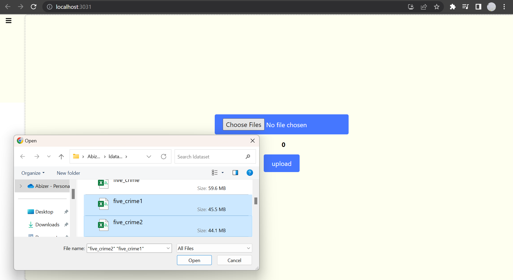

2) Click on Upload. The project is in Phase 1. If the progress bar has reached 100% and the page has not refreshed, it is because the backend flask is taking time to read the file into a pandas data frame

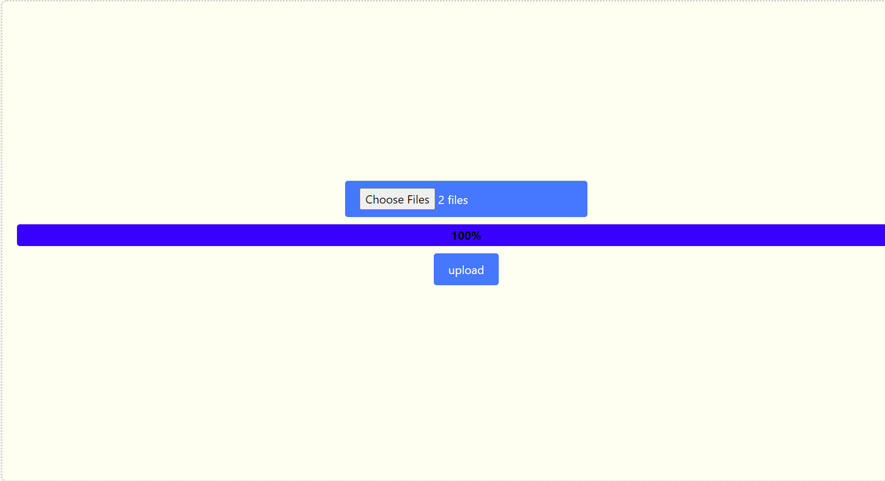

3) Select a file to see the first 10 rows. If the file has null rows, a table will be displayed below the above table showing the number of null values in each column:

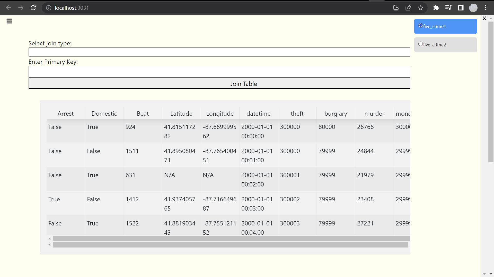

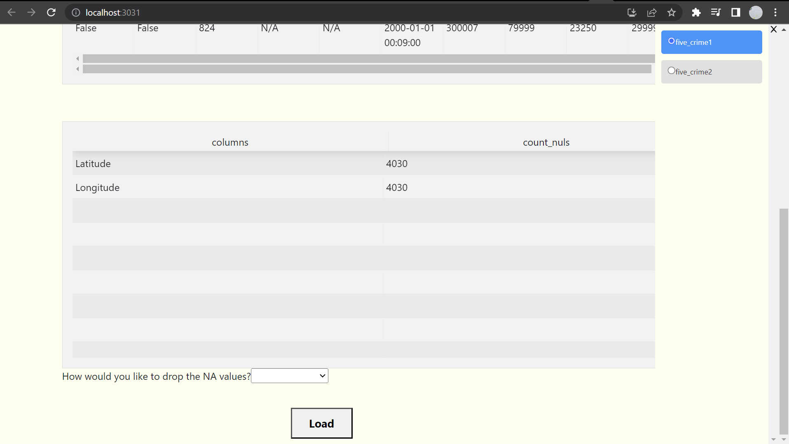

4) If you do not deal with the NA values, you will not be able to see the React Table later. If you would like to use just one table, select the table, drop the NA values and click on Load. On clicking load, the file data will be grouped at the backend for each of the columns and table will be formatted so that visualizations happen faster

5) To join files, select a join type, and unique primary key that is common between multiple tables and click on Join. The page will displayed the joined table along with the columns with null values if any

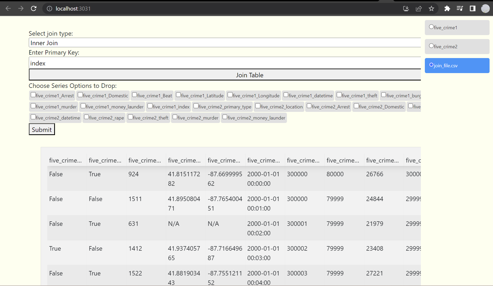

## **<u>Table</u>**

1) Select table in sidebar to display first 100 rows of file you have loaded

2) In the Calculation text box, you can perform basic arithmetic operation and filtering. Once typed, click enter on keyboard to perform computation

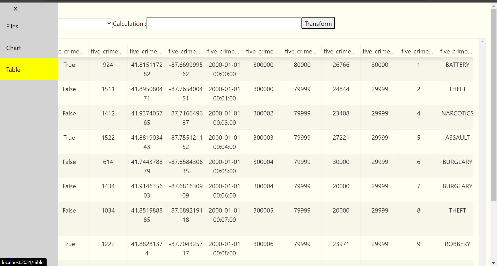

Format:
* ‘column_name’ = ‘column_name’ + ‘column_name’
* ‘column_name’ = ‘column_name’ * ‘column_name’
* ‘column_name’ = ‘column_name’ * ‘column_name’
* ‘column_name’ = ‘column_name’ + 1000
* ‘column_name’ = ‘column_name’ * 1000
* ‘column_name’ = ‘column_name’ / 1000
* ‘column_name’ = ‘column_name’ < 1000
* ‘column_name’ = ‘column_name’ > 1000
* ‘column_name’ = ‘column_name’ == 1000
* fmt = %Y-%m-%d %H:%M:%S  # Identify datetime columns

Real Life Examples:
* ‘rapes_burglaries’ = ‘rapes’ + ‘burglaries’
* ‘Rapes’ = ‘rapes’ < 1000

Remember to enclose the name of the column in quotation marks: “ “
Once done click on Transform table:

Transform re-performs group by operations on modified table. The datetime column will be grouped yearly, monthly and daily

## **<u>Chart</u>**

1) Now click on chart in sidebar to start building visualizations

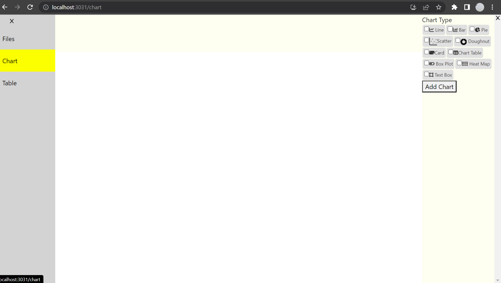

Example Chart Page:

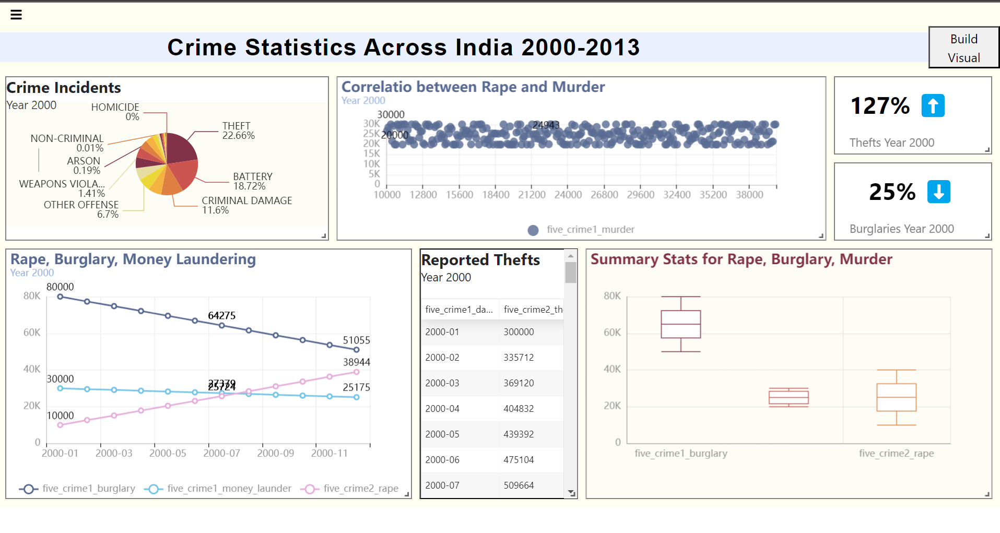

1) To create a new chart, select parameters in Build Visual and click enter once Data Processed appears or click on Add Chart

2) To delete a chart, select a chart and click on delete on keyboard. You know that you have selected a chart if it lights up:

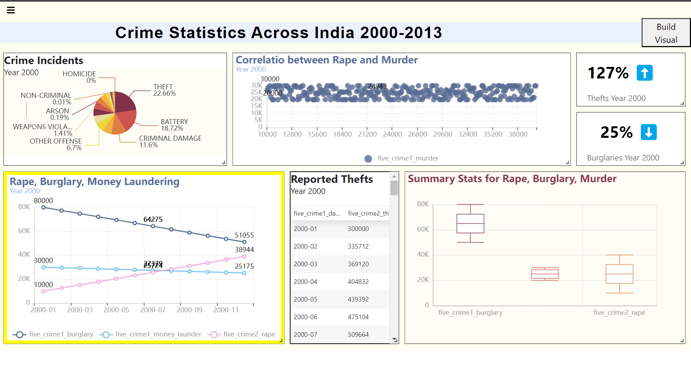

3) To modify an existing chart, click on chart. When the chart border is highlighted like above, all parameter in Build Visual will be autofilled:

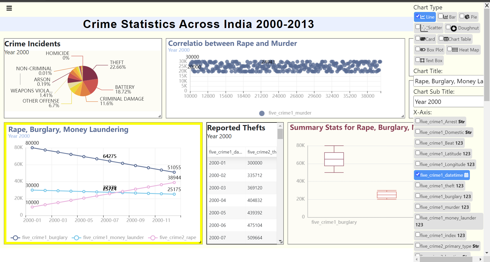

Once you have modified and data processed appears at the bottom click enter key on keyboard to update chart

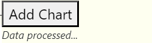

4) To add Page Title, click on top of page:

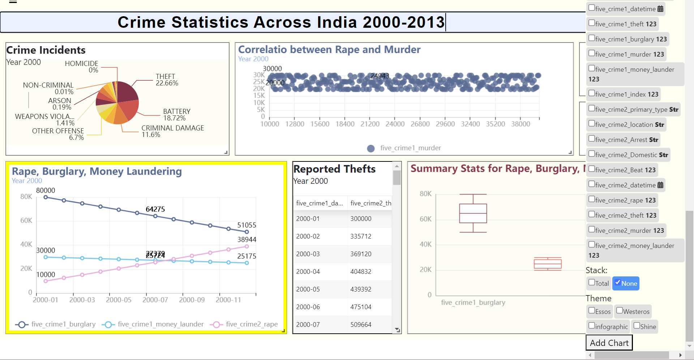

5) To change theme of chart, select the chart and click on a theme option